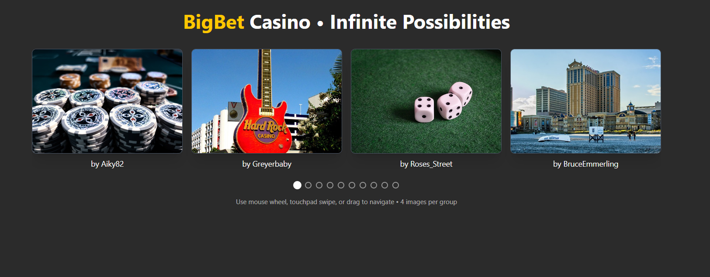

# Infinite Image Carousel



## Project Overview

This is a modern, responsive infinite image carousel built with React and TypeScript. The carousel features smooth scrolling, drag navigation, and adaptive layouts for both desktop and mobile devices.

## Key Features

- **Infinite Loop**: Seamless navigation that loops endlessly through images
- **Responsive Design**: Shows 4 images on desktop, 2 on mobile
- **Touch & Drag Navigation**: Support for mouse drag, touch gestures, and scroll wheel
- **Performance Optimized**: Handles large image sets (1000+) efficiently
- **API Integration**: Fetches high-quality images from Pixabay API
- **Modern UI**: Clean, casino-themed design with smooth animations

## Technologies Used

- **React 19** with TypeScript
- **Vite** for fast development and building
- **Tailwind CSS** for styling
- **Vitest** for testing
- **Testing Library** for component testing

## Quick Start

1. **Install dependencies**
   ```bash
   npm install
   ```

2. **Set up environment variables**
   Create a `.env` file in the root directory:
   ```
   VITE_PIXABAY_API_KEY=your_pixabay_api_key_here
   ```

3. **Start development server**
   ```bash
   npm run dev
   ```

4. **Run tests**
   ```bash
   npm test
   ```

## Testing

The project includes comprehensive tests covering:
- API integration (fetching 50 images)
- Responsive layout (4 images on desktop, 2 on mobile)
- Component rendering and error handling

Run tests with UI:
```bash
npm run test:ui
```

## Project Structure

```
src/
├── components/
│   └── GroupCarousel.tsx    # Main carousel component
├── utils/
│   └── imageApi.ts          # API integration utilities
├── tests/
│   └── components/          # Test files
└── App.tsx                  # Main application
```

## Architecture Highlights

- **Reusable Components**: Modular carousel component that can be easily integrated
- **Responsive Logic**: Adaptive grid system using Tailwind CSS
- **Performance**: Lazy loading and efficient image handling
- **Accessibility**: Proper ARIA labels and keyboard navigation support
- **Modern React Patterns**: Hooks, TypeScript, and functional components
